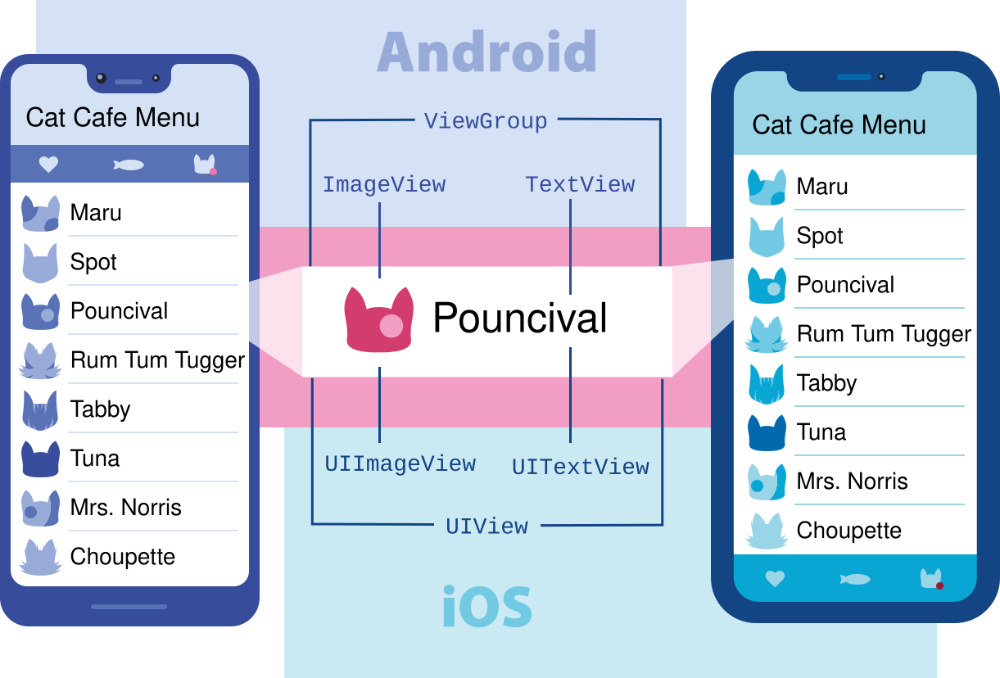
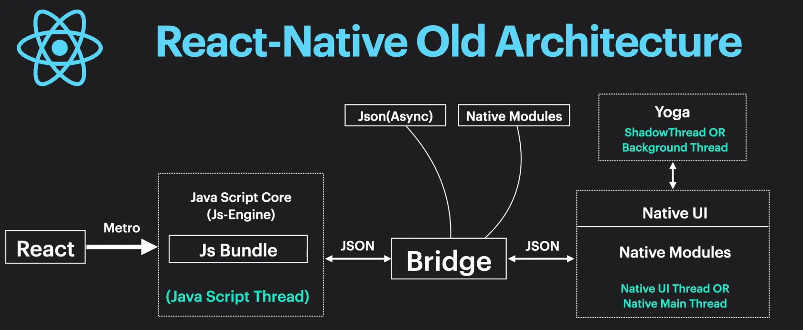
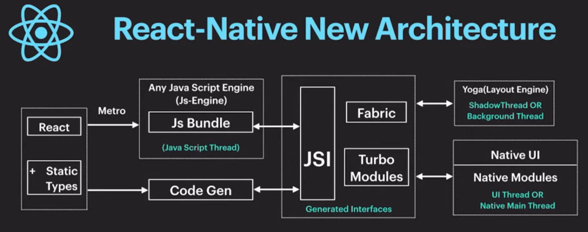

# Lab 2 Tutorial: Styling, Views, Lists, and Components

This comprehensive tutorial covers essential React Native concepts for building mobile applications:

1. **React Native Architecture** - Old vs New Architecture comparison
2. **Props and State** - Component data flow and state management
3. **SafeAreaView** - Handling device safe areas
4. **Styling** - StyleSheet API and styling patterns
5. **Flexbox** - Layout system
6. **FlatList** - Efficient list rendering
7. **Activity Indicator** - Loading states
8. **Splash Screen** - App loading screens
9. **ScrollView** - Scrollable content containers

---

## Core Components

React Native has many Core Components for everything from controls to activity indicators. You can find them all documented in the API section. You will mostly work with the following Core Components:



### Core Components Overview

| React Native UI Component | Android View | iOS View | Web Analog | Description |
|---------------------------|--------------|----------|------------|-------------|
| `<View>` | `<ViewGroup>` | `<UIView>` | A non-scrolling `<div>` | A container that supports layout with flexbox, style, some touch handling, and accessibility controls |
| `<Text>` | `<TextView>` | `<UITextView>` | `<p>` | Displays, styles, and nests strings of text and even handles touch events |
| `<Image>` | `<ImageView>` | `<UIImageView>` | `` | Displays different types of images |
| `<ScrollView>` | `<ScrollView>` | `<UIScrollView>` | `<div>` | A generic scrolling container that can contain multiple components and views |
| `<TextInput>` | `<EditText>` | `<UITextField>` | `<input type="text">` | Allows the user to enter text |

### Important Note: Missing Built-in Components

**React Native does not have built-in support for:**
- ❌ **Radio buttons** - No `<Radio>` or `<RadioButton>` component
- ❌ **Checkboxes** - No `<Checkbox>` component (except on Android with limited styling)
- ❌ **Select/Dropdown** - No `<Select>` or `<Dropdown>` component

**Solution:** You need to use **community libraries** or create custom components for these UI elements.

**Popular Community Libraries:**
- **react-native-paper** - Material Design components including Checkbox, RadioButton, and more
- **react-native-elements** - UI toolkit with CheckBox and other components
- **@react-native-community/picker** - For dropdown/select functionality
- **react-native-check-box** - Standalone checkbox component
- **react-native-radio-buttons-group** - Radio button group component


## React Native Architecture: Old vs New

React Native has evolved significantly with the introduction of the **New Architecture**. Understanding the differences helps you build better apps and prepare for the future.

### Old Architecture (Legacy)



The **Old Architecture** (also called Legacy Architecture) uses a bridge-based communication system:

**Key Characteristics:**
- **Bridge-based communication** - JavaScript and native code communicate through an asynchronous bridge
- **Serialization overhead** - Data must be serialized when crossing the bridge
- **Asynchronous** - All communication is asynchronous, which can cause performance issues
- **Three threads:**
  - JavaScript thread (runs React code)
  - Native/UI thread (handles native UI)
  - Shadow thread (calculates layouts)

**Limitations:**
- Performance bottlenecks due to bridge serialization
- Cannot directly access native modules synchronously
- Layout calculations happen on a separate thread
- Slower startup times

### New Architecture



The **New Architecture** (introduced in React Native 0.68+) provides direct, synchronous communication:

**Key Characteristics:**
- **JSI (JavaScript Interface)** - Direct, synchronous communication between JavaScript and native code
- **Fabric** - New rendering system that allows synchronous UI updates
- **TurboModules** - Improved native module system with lazy loading
- **Codegen** - Type-safe code generation for better performance

**Benefits:**
- **Better Performance** - Synchronous communication eliminates bridge overhead
- **Faster Startup** - Lazy loading of native modules
- **Type Safety** - Codegen ensures type safety
- **Concurrent Features** - Support for React 18 concurrent features
- **Better Debugging** - Improved developer experience

### Reference Links

- **React Native Architecture:** https://reactnative.dev/docs/the-new-architecture/landing-page
- **New Architecture Overview:** https://reactnative.dev/docs/the-new-architecture/introduction
- **Migration Guide:** https://reactnative.dev/docs/the-new-architecture/migration-guide

---

## Props and State

Understanding **Props** and **State** is fundamental to React Native development. These concepts allow you to create dynamic, interactive components.

### Props (Properties)

**Props** are read-only data passed from parent components to child components. They allow you to customize and configure components.

#### Basic Props Usage

```javascript
import { View, Text } from 'react-native';

// Child component receiving props
function Greeting({ name, age }) {
  return (
    <View>
      <Text>Hello, {name}!</Text>
      <Text>You are {age} years old.</Text>
    </View>
  );
}

// Parent component passing props
export default function App() {
  return (
    <View>
      <Greeting name="Alice" age={25} />
      <Greeting name="Bob" age={30} />
    </View>
  );
}
```


### State

**State** is data that belongs to a component and can change over time. When state changes, React Native re-renders the component.

#### useState Hook

```javascript
import { useState } from 'react';
import { View, Text, Button } from 'react-native';

export default function Counter() {
  const [count, setCount] = useState(0);

  return (
    <View>
      <Text>Count: {count}</Text>
      <Button 
        title="Increment" 
        onPress={() => setCount(count + 1)} 
      />
      <Button 
        title="Decrement" 
        onPress={() => setCount(count - 1)} 
      />
    </View>
  );
}
```

#### Multiple State Variables

```javascript
import { useState } from 'react';
import { View, TextInput, Text } from 'react-native';

export default function Form() {
  const [name, setName] = useState('');
  const [email, setEmail] = useState('');
  const [age, setAge] = useState('');

  return (
    <View>
      <TextInput
        placeholder="Name"
        value={name}
        onChangeText={setName}
      />
      <TextInput
        placeholder="Email"
        value={email}
        onChangeText={setEmail}
        keyboardType="email-address"
      />
      <TextInput
        placeholder="Age"
        value={age}
        onChangeText={setAge}
        keyboardType="numeric"
      />
      <Text>Name: {name}</Text>
      <Text>Email: {email}</Text>
      <Text>Age: {age}</Text>
    </View>
  );
}
```

### Reference Links

- **React Props:** https://react.dev/learn/passing-props-to-a-component
- **React State:** https://react.dev/learn/state-a-components-memory
- **useState Hook:** https://react.dev/reference/react/useState
- **Lifting State Up:** https://react.dev/learn/sharing-state-between-components

---

## SafeAreaView

SafeAreaView ensures content is displayed within the safe area boundaries of a device, avoiding notches, status bars, and home indicators.

**Note:** The built-in `SafeAreaView` from `react-native` is deprecated. Use `react-native-safe-area-context` instead.

### Installation

```bash
npx expo install react-native-safe-area-context
```

### Basic Usage (Recommended)

```javascript
import { SafeAreaProvider, SafeAreaView } from 'react-native-safe-area-context';
import { Text, StyleSheet } from 'react-native';

export default function App() {
  return (
    <SafeAreaProvider>
      <SafeAreaView style={styles.container}>
        <Text>This content is safe from device notches!</Text>
      </SafeAreaView>
    </SafeAreaProvider>
  );
}

const styles = StyleSheet.create({
  container: {
    flex: 1,
    backgroundColor: '#fff',
  },
});
```

### Custom Safe Area Edges

You can specify which edges to apply safe area insets:

```javascript
import { SafeAreaProvider, SafeAreaView } from 'react-native-safe-area-context';

export default function App() {
  return (
    <SafeAreaProvider>
      <SafeAreaView style={styles.container} edges={['top', 'bottom']}>
        <Text>Content with custom safe area edges</Text>
      </SafeAreaView>
    </SafeAreaProvider>
  );
}
```

**Available edge options:** `'top'`, `'bottom'`, `'left'`, `'right'`, or `[]` for all edges.

### When to Use SafeAreaView

- ✅ Top-level container for full-screen layouts
- ✅ When you want automatic safe area handling
- ✅ iOS devices with notches (iPhone X and later)
- ✅ Android devices with different screen configurations

### Deprecated Usage (Don't Use)

```javascript
// ❌ Deprecated - Don't use this
import { SafeAreaView } from 'react-native';
```

### Reference Links

- **react-native-safe-area-context:** https://github.com/th3rdwave/react-native-safe-area-context
- **SafeAreaView Documentation:** https://reactnative.dev/docs/safeareaview

---

### Important Component Descriptions

#### View

**`<View>`** is the most fundamental component for building UI in React Native. It's a container that supports layout with flexbox, styling, touch handling, and accessibility controls.

**Key Features:**
- Container component that can hold other components
- Supports flexbox layout (default layout system)
- Can handle touch events
- Supports styling with StyleSheet
- No default styling (unlike web divs)

**Basic Usage:**
```javascript
import { View } from 'react-native';

<View style={{ flex: 1, backgroundColor: '#fff' }}>
  {/* Your content here */}
</View>
```

---

#### Text

**`<Text>`** is the only way to render text in React Native. Unlike web development, you cannot put text directly inside a `<View>` - it must be wrapped in a `<Text>` component.

**Key Features:**
- Required for displaying any text
- Supports nested text with different styles
- Can handle touch events (onPress)
- Supports text styling (fontSize, color, fontWeight, etc.)

**Basic Usage:**
```javascript
import { Text } from 'react-native';

<Text style={{ fontSize: 18, color: '#333' }}>
  Hello, React Native!
</Text>

// Nested text with different styles
<Text>
  Normal text <Text style={{ fontWeight: 'bold' }}>Bold text</Text>
</Text>
```

---

#### Image

**`<Image>`** displays different types of images including local assets, network images, and base64 data.

**Key Features:**
- Supports local images (require('./image.png'))
- Supports network images (uri: 'https://...')
- Supports base64 encoded images
- Requires explicit width/height or aspect ratio
- Supports resize modes (cover, contain, stretch, etc.)

**Basic Usage:**
```javascript
import { Image } from 'react-native';

// Local image
<Image source={require('./assets/logo.png')} />

// Network image
<Image 
  source={{ uri: 'https://example.com/image.jpg' }}
  style={{ width: 200, height: 200 }}
/>

// With resize mode
<Image 
  source={require('./assets/photo.jpg')}
  style={{ width: 300, height: 200 }}
  resizeMode="cover"
/>
```

---

#### TextInput

**`<TextInput>`** allows users to enter text. It's similar to HTML input fields but with mobile-specific features.

**Key Features:**
- Single-line and multi-line text input
- Supports keyboard types (numeric, email, phone, etc.)
- Supports placeholder text
- Controlled component (use value and onChangeText)
- Supports secure text entry for passwords

**Basic Usage:**
```javascript
import { TextInput } from 'react-native';
import { useState } from 'react';

const [text, setText] = useState('');

<TextInput
  style={{ borderWidth: 1, padding: 10 }}
  placeholder="Enter your name"
  value={text}
  onChangeText={setText}
/>

// Password input
<TextInput
  secureTextEntry={true}
  placeholder="Password"
  value={password}
  onChangeText={setPassword}
/>

// Multi-line
<TextInput
  multiline={true}
  numberOfLines={4}
  placeholder="Enter your message"
/>
```

---

#### Button

**`<Button>`** is a basic button component that triggers an onPress callback when tapped.

**Key Features:**
- Simple button with title and onPress handler
- Platform-specific styling (iOS vs Android)
- Limited customization (for custom buttons, use TouchableOpacity)
- Accessible by default

**Basic Usage:**
```javascript
import { Button } from 'react-native';

<Button
  title="Press Me"
  onPress={() => alert('Button pressed!')}
  color="#007AFF"  // iOS only
/>

// For more customization, use TouchableOpacity instead
```

**Note:** For custom-styled buttons, use `TouchableOpacity` with a `Text` component inside.

---

#### TouchableOpacity

**`<TouchableOpacity>`** is a wrapper that makes its children respond to touch events with opacity feedback. It's commonly used to create custom buttons and touchable elements.

**Key Features:**
- Provides visual feedback (opacity changes on press)
- More customizable than Button
- Supports onPress, onLongPress, disabled states
- Can wrap any component to make it touchable

**Basic Usage:**
```javascript
import { TouchableOpacity, Text } from 'react-native';

<TouchableOpacity
  onPress={() => console.log('Pressed!')}
  style={{ backgroundColor: '#007AFF', padding: 15, borderRadius: 8 }}
>
  <Text style={{ color: '#fff', textAlign: 'center' }}>
    Custom Button
  </Text>
</TouchableOpacity>

// Disabled state
<TouchableOpacity
  disabled={true}
  style={{ opacity: 0.5 }}
>
  <Text>Disabled Button</Text>
</TouchableOpacity>
```

---

#### Modal

**`<Modal>`** presents content above an enclosing view. It's used for dialogs, alerts, or overlays.

**Key Features:**
- Displays content in a modal overlay
- Supports animation (animated prop)
- Can be transparent
- Supports presentation styles (iOS)
- Requires visible prop to show/hide

**Basic Usage:**
```javascript
import { Modal, View, Text, Button } from 'react-native';
import { useState } from 'react';

const [modalVisible, setModalVisible] = useState(false);

<Modal
  animationType="slide"
  transparent={true}
  visible={modalVisible}
  onRequestClose={() => setModalVisible(false)}
>
  <View style={{ flex: 1, justifyContent: 'center', alignItems: 'center', backgroundColor: 'rgba(0,0,0,0.5)' }}>
    <View style={{ backgroundColor: '#fff', padding: 20, borderRadius: 10 }}>
      <Text>Modal Content</Text>
      <Button title="Close" onPress={() => setModalVisible(false)} />
    </View>
  </View>
</Modal>
```

---

#### Alert

**`<Alert>`** displays an alert dialog with a message and optional buttons. It's a cross-platform API for showing alert dialogs.

**Key Features:**
- Cross-platform alert dialogs
- Simple API (Alert.alert())
- Supports multiple buttons
- No JSX needed - called as a function
- Platform-specific styling

**Basic Usage:**
```javascript
import { Alert } from 'react-native';

// Simple alert
Alert.alert('Title', 'Message');

// Alert with buttons
Alert.alert(
  'Delete Item',
  'Are you sure you want to delete this item?',
  [
    {
      text: 'Cancel',
      onPress: () => console.log('Cancel pressed'),
      style: 'cancel',
    },
    {
      text: 'Delete',
      onPress: () => console.log('Delete pressed'),
      style: 'destructive',
    },
  ]
);

// Alert with three buttons
Alert.alert(
  'Update Available',
  'A new version is available. Would you like to update?',
  [
    { text: 'Later', style: 'cancel' },
    { text: 'Update Now', onPress: () => updateApp() },
    { text: 'Remind Me', onPress: () => scheduleReminder() },
  ]
);
```

### Understanding Core Components

React Native components are **native components** - they map directly to the native UI building blocks of iOS and Android platforms. This means when you use `<View>`, `<Text>`, `<Image>`, or any other component, React Native renders the corresponding native view on each platform.

In the following sections, you will learn how to combine these Core Components with styling, layout systems, and advanced components to build complete mobile applications.

### Reference Links

- **React Native Core Components:** https://reactnative.dev/docs/components-and-apis
- **View Component:** https://reactnative.dev/docs/view
- **Text Component:** https://reactnative.dev/docs/text
- **Image Component:** https://reactnative.dev/docs/image
- **TextInput Component:** https://reactnative.dev/docs/textinput
- **Button Component:** https://reactnative.dev/docs/button
- **TouchableOpacity Component:** https://reactnative.dev/docs/touchableopacity
- **Modal Component:** https://reactnative.dev/docs/modal
- **Alert API:** https://reactnative.dev/docs/alert

---

## 1. Styling in React Native

React Native uses JavaScript objects for styling, similar to CSS but with some key differences.

### StyleSheet API

```javascript
import { StyleSheet } from 'react-native';

const styles = StyleSheet.create({
  container: {
    flex: 1,
    backgroundColor: '#fff',
    padding: 20,
  },
  text: {
    fontSize: 18,
    color: '#333',
    fontWeight: 'bold',
  },
});
```

### Key Differences from CSS

| CSS | React Native | Notes |
|-----|--------------|-------|
| `background-color` | `backgroundColor` | Use camelCase |
| `font-size` | `fontSize` | Use camelCase |
| `margin-top` | `marginTop` | Use camelCase |
| `10px` | `10` | No units needed (density-independent pixels) |
| `display: flex` | Default | Flexbox is default layout |

### Common Style Properties

```javascript
const styles = StyleSheet.create({
  container: {
    // Layout
    flex: 1,                    // Take available space
    width: '100%',              // Full width
    height: 200,                // Fixed height
    
    // Spacing
    margin: 10,                 // All sides
    marginTop: 20,             // Individual sides
    padding: 15,
    paddingHorizontal: 10,     // Left & right
    paddingVertical: 5,        // Top & bottom
    
    // Colors
    backgroundColor: '#ffffff',
    color: '#000000',          // For text
    
    // Borders
    borderWidth: 1,
    borderColor: '#ccc',
    borderRadius: 8,
    
    // Alignment
    alignItems: 'center',      // Cross-axis
    justifyContent: 'center', // Main-axis
  },
});
```

### Reference Links

- **React Native StyleSheet Documentation:** https://reactnative.dev/docs/stylesheet
- **React Native Style Props:** https://reactnative.dev/docs/view-style-props
- **Text Style Props:** https://reactnative.dev/docs/text-style-props

---

## 2. Flexbox Layout

Flexbox is the default layout system in React Native. It's essential for creating responsive layouts.

### Flexbox Basics

```javascript
import { View, StyleSheet } from 'react-native';

export default function App() {
  return (
    <View style={styles.container}>
      <View style={styles.box1} />
      <View style={styles.box2} />
      <View style={styles.box3} />
    </View>
  );
}

const styles = StyleSheet.create({
  container: {
    flex: 1,
    flexDirection: 'row',        // 'row' or 'column' (default)
    justifyContent: 'center',   // Main axis alignment
    alignItems: 'center',       // Cross axis alignment
  },
  box1: {
    width: 50,
    height: 50,
    backgroundColor: 'red',
  },
  box2: {
    width: 50,
    height: 50,
    backgroundColor: 'blue',
  },
  box3: {
    width: 50,
    height: 50,
    backgroundColor: 'green',
  },
});
```

### Flexbox Properties

#### Container Properties

| Property | Values | Description |
|----------|--------|-------------|
| `flexDirection` | `'row'`, `'column'` | Main axis direction |
| `justifyContent` | `'flex-start'`, `'flex-end'`, `'center'`, `'space-between'`, `'space-around'`, `'space-evenly'` | Main axis alignment |
| `alignItems` | `'flex-start'`, `'flex-end'`, `'center'`, `'stretch'`, `'baseline'` | Cross axis alignment |
| `flexWrap` | `'nowrap'`, `'wrap'` | Allow items to wrap |
| `alignContent` | Similar to `justifyContent` | Alignment when wrapping |

#### Item Properties

| Property | Values | Description |
|----------|--------|-------------|
| `flex` | Number | Grow/shrink factor (e.g., `1`, `2`) |
| `alignSelf` | Same as `alignItems` | Override container alignment |
| `flexGrow` | Number | Grow factor |
| `flexShrink` | Number | Shrink factor |
| `flexBasis` | Number or `'auto'` | Initial size |

### Common Flexbox Patterns

#### Centered Content

```javascript
container: {
  flex: 1,
  justifyContent: 'center',
  alignItems: 'center',
}
```

#### Space Between Items

```javascript
container: {
  flexDirection: 'row',
  justifyContent: 'space-between',
  alignItems: 'center',
}
```

#### Equal Width Items

```javascript
item: {
  flex: 1,  // Each item takes equal space
}
```

#### Responsive Layout

```javascript
container: {
  flex: 1,
  flexDirection: 'row',
  flexWrap: 'wrap',
}
item: {
  width: '50%',  // Two items per row
}
```

### Reference Links

- **React Native Layout Props:** https://reactnative.dev/docs/layout-props
- **CSS Flexbox Guide:** https://css-tricks.com/snippets/css/a-guide-to-flexbox/
- **Flexbox Froggy (Interactive Learning):** https://flexboxfroggy.com/

---

## 3.5. Practice: Styling, SafeAreaView, and Flexbox

Now that you've learned about Styling, SafeAreaView, and Flexbox, let's practice combining these concepts!

### Practice Exercise 1: Basic Layout

Create a simple app with:
- SafeAreaView as the container
- A header section with centered title
- A main content area with three boxes arranged horizontally
- Use Flexbox to space the boxes evenly

**Solution:**

```javascript
import { SafeAreaProvider, SafeAreaView } from 'react-native-safe-area-context';
import { View, Text, StyleSheet } from 'react-native';

export default function App() {
  return (
    <SafeAreaProvider>
      <SafeAreaView style={styles.container}>
        <View style={styles.header}>
          <Text style={styles.title}>My Practice App</Text>
        </View>
        
        <View style={styles.content}>
          <View style={styles.box}>
            <Text style={styles.boxText}>Box 1</Text>
          </View>
          <View style={styles.box}>
            <Text style={styles.boxText}>Box 2</Text>
          </View>
          <View style={styles.box}>
            <Text style={styles.boxText}>Box 3</Text>
          </View>
        </View>
      </SafeAreaView>
    </SafeAreaProvider>
  );
}

const styles = StyleSheet.create({
  container: {
    flex: 1,
    backgroundColor: '#f5f5f5',
  },
  header: {
    padding: 20,
    backgroundColor: '#007AFF',
    alignItems: 'center',
  },
  title: {
    fontSize: 24,
    fontWeight: 'bold',
    color: '#fff',
  },
  content: {
    flex: 1,
    flexDirection: 'row',
    justifyContent: 'space-around',
    alignItems: 'center',
    padding: 20,
  },
  box: {
    width: 80,
    height: 80,
    backgroundColor: '#fff',
    borderRadius: 8,
    justifyContent: 'center',
    alignItems: 'center',
    shadowColor: '#000',
    shadowOffset: { width: 0, height: 2 },
    shadowOpacity: 0.1,
    shadowRadius: 4,
    elevation: 3,
  },
  boxText: {
    fontSize: 16,
    fontWeight: '600',
    color: '#333',
  },
});
```

### Practice Exercise 2: Card Layout

Create a card-based layout with:
- SafeAreaView container
- Multiple cards arranged vertically
- Each card should have padding, border radius, and shadow
- Use Flexbox to space cards evenly

**Solution:**

```javascript
import { SafeAreaProvider, SafeAreaView } from 'react-native-safe-area-context';
import { View, Text, StyleSheet, ScrollView } from 'react-native';

const cards = [
  { id: 1, title: 'Card 1', description: 'This is the first card' },
  { id: 2, title: 'Card 2', description: 'This is the second card' },
  { id: 3, title: 'Card 3', description: 'This is the third card' },
];

export default function App() {
  return (
    <SafeAreaProvider>
      <SafeAreaView style={styles.container}>
        <View style={styles.header}>
          <Text style={styles.title}>Card Layout</Text>
        </View>
        
        <ScrollView style={styles.scrollView} contentContainerStyle={styles.content}>
          {cards.map((card) => (
            <View key={card.id} style={styles.card}>
              <Text style={styles.cardTitle}>{card.title}</Text>
              <Text style={styles.cardDescription}>{card.description}</Text>
            </View>
          ))}
        </ScrollView>
      </SafeAreaView>
    </SafeAreaProvider>
  );
}

const styles = StyleSheet.create({
  container: {
    flex: 1,
    backgroundColor: '#f5f5f5',
  },
  header: {
    padding: 20,
    backgroundColor: '#fff',
    borderBottomWidth: 1,
    borderBottomColor: '#e0e0e0',
  },
  title: {
    fontSize: 24,
    fontWeight: 'bold',
    color: '#333',
  },
  scrollView: {
    flex: 1,
  },
  content: {
    padding: 16,
    gap: 16,
  },
  card: {
    backgroundColor: '#fff',
    padding: 20,
    borderRadius: 12,
    shadowColor: '#000',
    shadowOffset: { width: 0, height: 2 },
    shadowOpacity: 0.1,
    shadowRadius: 4,
    elevation: 3,
  },
  cardTitle: {
    fontSize: 20,
    fontWeight: 'bold',
    color: '#333',
    marginBottom: 8,
  },
  cardDescription: {
    fontSize: 14,
    color: '#666',
  },
});
```

### Practice Exercise 3: Responsive Grid

Create a responsive grid layout that:
- Shows 2 items per row on small screens
- Uses Flexbox with flexWrap
- Each item has equal width

**Solution:**

```javascript
import { SafeAreaProvider, SafeAreaView } from 'react-native-safe-area-context';
import { View, Text, StyleSheet } from 'react-native';

const items = Array.from({ length: 6 }, (_, i) => ({
  id: i + 1,
  title: `Item ${i + 1}`,
}));

export default function App() {
  return (
    <SafeAreaProvider>
      <SafeAreaView style={styles.container}>
        <View style={styles.header}>
          <Text style={styles.title}>Responsive Grid</Text>
        </View>
        
        <View style={styles.grid}>
          {items.map((item) => (
            <View key={item.id} style={styles.gridItem}>
              <Text style={styles.gridItemText}>{item.title}</Text>
            </View>
          ))}
        </View>
      </SafeAreaView>
    </SafeAreaProvider>
  );
}

const styles = StyleSheet.create({
  container: {
    flex: 1,
    backgroundColor: '#f5f5f5',
  },
  header: {
    padding: 20,
    backgroundColor: '#fff',
    alignItems: 'center',
  },
  title: {
    fontSize: 24,
    fontWeight: 'bold',
    color: '#333',
  },
  grid: {
    flex: 1,
    flexDirection: 'row',
    flexWrap: 'wrap',
    padding: 10,
    justifyContent: 'space-between',
  },
  gridItem: {
    width: '48%',
    aspectRatio: 1,
    backgroundColor: '#fff',
    borderRadius: 8,
    justifyContent: 'center',
    alignItems: 'center',
    marginBottom: 10,
    shadowColor: '#000',
    shadowOffset: { width: 0, height: 2 },
    shadowOpacity: 0.1,
    shadowRadius: 4,
    elevation: 3,
  },
  gridItemText: {
    fontSize: 18,
    fontWeight: '600',
    color: '#333',
  },
});
```

---

## 4. FlatList

FlatList is optimized for rendering large lists efficiently. It only renders items that are currently visible.

### Basic FlatList

```javascript
import { FlatList, Text, View, StyleSheet } from 'react-native';

const data = [
  { id: '1', title: 'Item 1' },
  { id: '2', title: 'Item 2' },
  { id: '3', title: 'Item 3' },
  // ... more items
];

export default function App() {
  return (
    <FlatList
      data={data}
      keyExtractor={(item) => item.id}
      renderItem={({ item }) => (
        <View style={styles.item}>
          <Text>{item.title}</Text>
        </View>
      )}
    />
  );
}

const styles = StyleSheet.create({
  item: {
    padding: 20,
    borderBottomWidth: 1,
    borderBottomColor: '#ccc',
  },
});
```

### FlatList with Separator

```javascript
<FlatList
  data={data}
  keyExtractor={(item) => item.id}
  renderItem={({ item }) => (
    <View style={styles.item}>
      <Text>{item.title}</Text>
    </View>
  )}
  ItemSeparatorComponent={() => <View style={styles.separator} />}
  ListHeaderComponent={() => <Text style={styles.header}>Header</Text>}
  ListFooterComponent={() => <Text style={styles.footer}>Footer</Text>}
  ListEmptyComponent={() => <Text>No items found</Text>}
/>
```

### FlatList Properties

```javascript
<FlatList
  data={data}
  renderItem={renderItem}
  keyExtractor={(item) => item.id}
  
  // Performance
  initialNumToRender={10}           // Items to render initially
  maxToRenderPerBatch={10}          // Items per batch
  windowSize={21}                   // Viewport multiplier
  
  // Layout
  numColumns={1}                    // Number of columns
  horizontal={false}               // Horizontal list
  inverted={false}                  // Reverse order
  
  // Styling
  contentContainerStyle={styles.content}
  style={styles.list}
  
  // Events
  onEndReached={() => loadMore()}   // Load more when reaching end
  onEndReachedThreshold={0.5}       // Trigger distance (0-1)
  onRefresh={() => refresh()}       // Pull to refresh
  refreshing={isRefreshing}        // Refresh state
/>
```

### Horizontal FlatList

```javascript
<FlatList
  data={data}
  horizontal={true}
  showsHorizontalScrollIndicator={false}
  renderItem={({ item }) => (
    <View style={styles.horizontalItem}>
      <Text>{item.title}</Text>
    </View>
  )}
  keyExtractor={(item) => item.id}
/>
```

### Reference Links

- **FlatList Documentation:** https://reactnative.dev/docs/flatlist
- **FlatList Props:** https://reactnative.dev/docs/flatlist#props
- **Performance Optimization:** https://reactnative.dev/docs/optimizing-flatlist-configuration

---

## 5. Activity Indicator

ActivityIndicator displays a loading spinner.

### Basic Usage

```javascript
import { ActivityIndicator, View, StyleSheet } from 'react-native';

export default function App() {
  return (
    <View style={styles.container}>
      <ActivityIndicator size="large" color="#007AFF" />
    </View>
  );
}

const styles = StyleSheet.create({
  container: {
    flex: 1,
    justifyContent: 'center',
    alignItems: 'center',
  },
});
```

### ActivityIndicator Properties

```javascript
<ActivityIndicator
  size="large"              // 'small' or 'large'
  color="#007AFF"          // Color of the spinner
  animating={true}         // Show/hide (default: true)
  hidesWhenStopped={true}  // Hide when not animating
/>
```

### Loading State Example

```javascript
import { useState } from 'react';
import { View, Text, ActivityIndicator, Button, StyleSheet } from 'react-native';

export default function App() {
  const [loading, setLoading] = useState(false);
  const [data, setData] = useState(null);

  const fetchData = async () => {
    setLoading(true);
    // Simulate API call
    setTimeout(() => {
      setData('Data loaded!');
      setLoading(false);
    }, 2000);
  };

  return (
    <View style={styles.container}>
      {loading ? (
        <ActivityIndicator size="large" color="#007AFF" />
      ) : (
        <>
          <Text>{data || 'No data'}</Text>
          <Button title="Load Data" onPress={fetchData} />
        </>
      )}
    </View>
  );
}
```

### Reference Links

- **ActivityIndicator Documentation:** https://reactnative.dev/docs/activityindicator
- **ActivityIndicator Props:** https://reactnative.dev/docs/activityindicator#props

---

## 6. Splash Screen

Splash screens display while your app is loading.

### Configure Splash Screen in app.json

```json
{
  "expo": {
    "splash": {
      "image": "./assets/splash.png",
      "resizeMode": "contain",
      "backgroundColor": "#ffffff"
    }
  }
}
```


### Reference Links

- **Expo Splash Screen:** https://docs.expo.dev/versions/latest/sdk/splash-screen/
- **Splash Screen API:** https://docs.expo.dev/versions/latest/sdk/splash-screen/#splashscreen

---

## 7. ScrollView

ScrollView enables scrolling when content exceeds the screen size.

### Basic ScrollView

```javascript
import { ScrollView, Text, View, StyleSheet } from 'react-native';

export default function App() {
  return (
    <ScrollView style={styles.container}>
      <View style={styles.item}>
        <Text>Item 1</Text>
      </View>
      <View style={styles.item}>
        <Text>Item 2</Text>
      </View>
      <View style={styles.item}>
        <Text>Item 3</Text>
      </View>
      {/* More items... */}
    </ScrollView>
  );
}

const styles = StyleSheet.create({
  container: {
    flex: 1,
  },
  item: {
    height: 100,
    backgroundColor: '#f0f0f0',
    margin: 10,
    justifyContent: 'center',
    alignItems: 'center',
  },
});
```

### ScrollView Properties

```javascript
<ScrollView
  style={styles.container}
  contentContainerStyle={styles.content}  // Style for content
  showsVerticalScrollIndicator={true}      // Show scrollbar
  showsHorizontalScrollIndicator={false}  // Hide horizontal scrollbar
  horizontal={false}                      // Vertical (default) or horizontal
  pagingEnabled={false}                   // Snap to pages
  scrollEnabled={true}                    // Enable/disable scrolling
  onScroll={(event) => {                 // Scroll event handler
    console.log(event.nativeEvent.contentOffset.y);
  }}
  scrollEventThrottle={16}               // Throttle scroll events
>
  {/* Content */}
</ScrollView>
```

### Horizontal ScrollView

```javascript
<ScrollView horizontal={true} showsHorizontalScrollIndicator={false}>
  <View style={styles.horizontalItem}><Text>Item 1</Text></View>
  <View style={styles.horizontalItem}><Text>Item 2</Text></View>
  <View style={styles.horizontalItem}><Text>Item 3</Text></View>
</ScrollView>
```

### Reference Links

- **ScrollView Documentation:** https://reactnative.dev/docs/scrollview
- **ScrollView Props:** https://reactnative.dev/docs/scrollview#props

---


## Complete Example: Combining All Concepts

```javascript
import { useState, useEffect } from 'react';
import {
  ScrollView,
  FlatList,
  View,
  Text,
  StyleSheet,
  ActivityIndicator,
  TextInput,
} from 'react-native';
import { SafeAreaProvider, SafeAreaView } from 'react-native-safe-area-context';
import * as SplashScreen from 'expo-splash-screen';

SplashScreen.preventAutoHideAsync();

const DATA = [
  { id: '1', title: 'Item 1' },
  { id: '2', title: 'Item 2' },
  { id: '3', title: 'Item 3' },
];

export default function App() {
  const [loading, setLoading] = useState(true);
  const [searchText, setSearchText] = useState('');

  useEffect(() => {
    // Simulate app initialization
    setTimeout(async () => {
      setLoading(false);
      await SplashScreen.hideAsync();
    }, 2000);
  }, []);

  if (loading) {
    return (
      <View style={styles.loadingContainer}>
        <ActivityIndicator size="large" color="#007AFF" />
      </View>
    );
  }

  return (
    <SafeAreaProvider>
      <SafeAreaView style={styles.container}>
      <View style={styles.header}>
        <Text style={styles.title}>My App</Text>
      </View>
      
      <TextInput
        style={styles.searchInput}
        placeholder="Search..."
        value={searchText}
        onChangeText={setSearchText}
      />

      <FlatList
        data={DATA}
        keyExtractor={(item) => item.id}
        renderItem={({ item }) => (
          <View style={styles.listItem}>
            <Text>{item.title}</Text>
          </View>
        )}
        ItemSeparatorComponent={() => <View style={styles.separator} />}
        contentContainerStyle={styles.listContent}
      />
      </SafeAreaView>
    </SafeAreaProvider>
  );
}

const styles = StyleSheet.create({
  container: {
    flex: 1,
    backgroundColor: '#fff',
  },
  loadingContainer: {
    flex: 1,
    justifyContent: 'center',
    alignItems: 'center',
  },
  header: {
    padding: 20,
    backgroundColor: '#f0f0f0',
    alignItems: 'center',
  },
  title: {
    fontSize: 24,
    fontWeight: 'bold',
  },
  searchInput: {
    margin: 15,
    padding: 10,
    borderWidth: 1,
    borderColor: '#ccc',
    borderRadius: 5,
  },
  listContent: {
    padding: 10,
  },
  listItem: {
    padding: 15,
    backgroundColor: '#f9f9f9',
  },
  separator: {
    height: 1,
    backgroundColor: '#eee',
  },
});
```

---

## Quick Reference

| Component | Use Case | Performance |
|-----------|----------|-------------|
| **ScrollView** | Small, simple lists | Renders all items |
| **FlatList** | Large, dynamic lists | Virtualized (efficient) |
| **SafeAreaView** | Avoid device notches | Minimal overhead |
| **ActivityIndicator** | Loading states | Lightweight |

---

## Best Practices

1. **Use FlatList for long lists** - Better performance than ScrollView
2. **Always use keyExtractor** - Helps React Native optimize rendering
3. **Use SafeAreaView from react-native-safe-area-context** - The built-in SafeAreaView is deprecated
4. **Wrap app in SafeAreaProvider** - Required for react-native-safe-area-context to work
5. **Show ActivityIndicator during async operations** - Better UX
6. **Use StyleSheet.create** - Better performance than inline styles
7. **Test on real devices** - SafeAreaView behavior varies by device

---

## Troubleshooting

### Common Issues and Solutions

#### Issue: SafeAreaView not working / Content hidden behind notch

**Problem:** Content appears behind the device notch or status bar.

**Solution:**
1. **Ensure you're using the correct SafeAreaView:**
   ```javascript
   // ✅ Correct - Use from react-native-safe-area-context
   import { SafeAreaProvider, SafeAreaView } from 'react-native-safe-area-context';
   
   // ❌ Incorrect - Built-in SafeAreaView is deprecated
   import { SafeAreaView } from 'react-native';
   ```

2. **Wrap your app with SafeAreaProvider:**
   ```javascript
   export default function App() {
     return (
       <SafeAreaProvider>
         <SafeAreaView style={styles.container}>
           {/* Your content */}
         </SafeAreaView>
       </SafeAreaProvider>
     );
   }
   ```

3. **If SafeAreaProvider is missing, install the package:**
   ```bash
   npx expo install react-native-safe-area-context
   ```

#### Issue: ScrollView/FlatList not scrolling

**Problem:** List content is not scrollable.

**Possible Causes & Solutions:**

1. **Missing flex style on container:**
   ```javascript
   // ✅ Correct
   <ScrollView style={{ flex: 1 }}>
   
   // ❌ Incorrect - Missing flex
   <ScrollView style={{ height: '100%' }}>
   ```

2. **Content not tall enough - ScrollView requires content to exceed container height:**
   - Ensure your content is actually taller than the screen
   - Use `contentContainerStyle` with `flexGrow: 1` for minimum height
   ```javascript
   <ScrollView 
     style={styles.container}
     contentContainerStyle={{ flexGrow: 1 }}
   >
   ```

3. **ScrollView nested inside View without flex:**
   ```javascript
   // ✅ Correct
   <View style={{ flex: 1 }}>
     <ScrollView style={{ flex: 1 }}>
   ```

#### Issue: FlatList warning: "VirtualizedLists should never be nested"

**Problem:** Getting warning about nested FlatList or ScrollView containing FlatList.

**Solution:**
- **Don't nest FlatList inside ScrollView** - Use FlatList's `ListHeaderComponent` instead:
  ```javascript
  // ✅ Correct
  <FlatList
    data={data}
    ListHeaderComponent={<Header />}
    renderItem={renderItem}
  />
  
  // ❌ Incorrect
  <ScrollView>
    <Header />
    <FlatList data={data} renderItem={renderItem} />
  </ScrollView>
  ```

- **If you need nested scrolling:** Use `nestedScrollEnabled={true}` (Android only, not recommended)

#### Issue: FlatList not rendering items / Empty list

**Problem:** FlatList shows nothing even though data exists.

**Solutions:**

1. **Check keyExtractor:**
   ```javascript
   // ✅ Correct - Unique key for each item
   keyExtractor={(item) => item.id.toString()}
   
   // ❌ Incorrect - Missing or duplicate keys
   keyExtractor={(item, index) => index}  // Avoid if data can change
   ```

2. **Check data format:**
   ```javascript
   // ✅ Correct - Array of objects
   const data = [{ id: 1, title: 'Item' }];
   
   // ❌ Incorrect - Not an array
   const data = { items: [...] };
   ```

3. **Verify renderItem returns a component:**
   ```javascript
   // ✅ Correct
   renderItem={({ item }) => <Text>{item.title}</Text>}
   
   // ❌ Incorrect - Not returning a component
   renderItem={({ item }) => item.title}
   ```

#### Issue: Styles not applying / Styling issues

**Problem:** Styles don't appear to be working.

**Solutions:**

1. **Check property names - Use camelCase:**
   ```javascript
   // ✅ Correct
   backgroundColor: '#fff'
   fontSize: 16
   
   // ❌ Incorrect
   background-color: '#fff'  // Won't work
   font-size: 16              // Won't work
   ```

2. **Ensure StyleSheet.create is used:**
   ```javascript
   // ✅ Correct - Better performance
   const styles = StyleSheet.create({ ... });
   
   // ⚠️ Works but not recommended - Inline styles
   <View style={{ flex: 1 }}>
   ```

3. **Check for conflicting styles:**
   - Styles are merged, later styles override earlier ones
   - Use array syntax for conditional styles: `style={[styles.base, styles.conditional]}`

#### Issue: Flexbox layout not working as expected

**Problem:** Items not positioning correctly with Flexbox.

**Solutions:**

1. **Ensure parent has flex: 1:**
   ```javascript
   container: {
     flex: 1,  // Required for flexbox to work properly
     flexDirection: 'row',
   }
   ```

2. **Check flexDirection:**
   - Default is `'column'` (vertical)
   - Use `'row'` for horizontal layouts

3. **Common flexbox mistakes:**
   ```javascript
   // ✅ Correct - Items will be centered
   container: {
     flex: 1,
     justifyContent: 'center',
     alignItems: 'center',
   }
   
   // ❌ Incorrect - Missing flex: 1
   container: {
     justifyContent: 'center',  // Won't work without flex
   }
   ```

#### Issue: ActivityIndicator not showing / Always showing

**Problem:** Loading indicator not displaying correctly.

**Solutions:**

1. **Check animating prop:**
   ```javascript
   // ✅ Correct
   <ActivityIndicator animating={loading} />
   
   // ❌ Incorrect - Always animating
   <ActivityIndicator animating={true} />
   ```

2. **Ensure ActivityIndicator is visible:**
   - Check if it's behind other components (z-index)
   - Verify parent container has proper layout

3. **Size and color:**
   ```javascript
   <ActivityIndicator 
     size="large"     // 'small' or 'large'
     color="#007AFF"  // Make sure color is visible
   />
   ```

#### Issue: Module not found errors

**Problem:** Error like "Cannot find module 'react-native-safe-area-context'".

**Solutions:**

1. **Install missing dependencies:**
   ```bash
   npx expo install react-native-safe-area-context
   ```

2. **Clear cache and reinstall:**
   ```bash
   # Delete node_modules
   rmdir /s /q node_modules  # Windows
   # Or: rm -rf node_modules  # macOS/Linux
   
   # Reinstall
   npm install
   
   # Clear Expo cache
   npx expo start --clear
   ```

3. **Verify package.json:**
   - Check that dependencies are listed in `package.json`
   - Ensure you're in the correct directory

#### Issue: Performance issues with long lists

**Problem:** App becomes slow with many list items.

**Solutions:**

1. **Use FlatList instead of ScrollView:**
   ```javascript
   // ✅ Correct - Virtualized (efficient)
   <FlatList data={data} renderItem={renderItem} />
   
   // ❌ Incorrect - Renders all items
   <ScrollView>
     {data.map(item => <Item key={item.id} />)}
   </ScrollView>
   ```

2. **Optimize FlatList:**
   ```javascript
   <FlatList
     data={data}
     renderItem={renderItem}
     keyExtractor={item => item.id.toString()}
     initialNumToRender={10}        // Render fewer items initially
     maxToRenderPerBatch={10}       // Batch size
     windowSize={21}                // Viewport multiplier
     removeClippedSubviews={true}   // Remove off-screen views
   />
   ```

3. **Use React.memo for complex items:**
   ```javascript
   const ListItem = React.memo(({ item }) => {
     return <View><Text>{item.title}</Text></View>;
   });
   ```

### Getting Help

If you encounter issues not covered here:

1. **Check React Native Documentation:** https://reactnative.dev/docs/getting-started
2. **Check Expo Documentation:** https://docs.expo.dev
3. **Clear cache:** `npx expo start --clear`
4. **Restart Metro bundler:** Stop (Ctrl+C) and restart `npx expo start`
5. **Check console errors:** Look for specific error messages in the terminal or device console

---

*Last Updated: January 2026*
